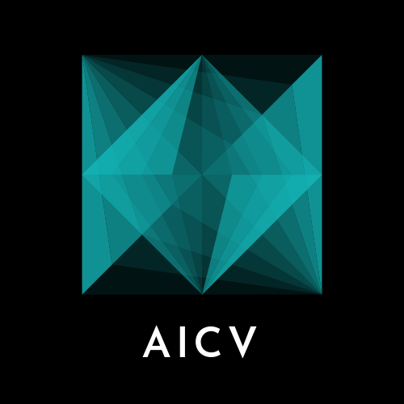

# AICV Lab



## Hosting on a local machine
You can use [this](https://hub.docker.com/repository/docker/kashu98/jekyll-serve/general) docker file to easily host this site on your local machine.

```bash
git clone https://github.com/UARK-AICV/UARK-AICV.github.io.git && cd UARK-AICV.github.io.git
docker run -it --rm --network=host -v $(pwd):/site kashu98/jekyll-serve
```

Then you can visit the site at `http://localhost:4000`

## Usage
### Add publications
1. modify `data/publist.yml`
1. add picture to `images/pubpic/`

Follow:
```yaml
- title: "Z-GMOT with MA-SORT: Zero-shot Generic Multiple Object Tracking (GMOT) with Motion Appearance SORT (MA-SORT)"
  image: k._tran_z_mot2024.png
  description: 
  authors: K. H. Tran, A. D. Le Dinh, T. P. Nguyen, T. Phan, P. Nguyen, K. Luu, D. Adjeroh, G. Doretto, N. Le
  link:
    url: https://fsoft-aic.github.io/Z-GMOT/
    display: K. H. Tran, A. D. Le Dinh, T. P. Nguyen, T. Phan, P. Nguyen, K. Luu, D. Adjeroh, G. Doretto, N. Le, , 2024
  type: 1
  news2:
  year: 2024
```

The corresponding type is:
- `1`: Conference Papers
- `2`: Journal Papers
- `3`: Patents

### Add Research
1. modify `data/research.yml`
1. add picture to `images/respic/`

Follow:
```yaml
- title: "Robust Hand Detection and Classification in Vehicles and in the Wild."
  image: Res_c_n_doung_ieee17.png
  url: https://openaccess.thecvf.com/content_cvpr_2017_workshops/w13/html/Le_Robust_Hand_Detection_CVPR_2017_paper.html
  description: C. N. Duong, K. G. Quach, K. Luu, N. Le, M. Savvides, IEEE, 2017
  category: Computer Vision
  subCategory: Image Understanding
```

### Add news
1. modify `data/news.yml`
1. add picture to `images/newspic/`

Follow:
```yaml
- date: Dec 13th 2018
  headline: "New paper! <a href='http://science.sciencemag.org/content/362/6420/eaat6576.long'> An et al. 2018 </a> published in Science, highlights the role of promoters in autism."

```

### Add team member
1. modify `data/team_members.yml`
1. add markdown file to `team/`
1. add picture to `images/teampic/`

or you can run:
```bash
python add_member.py
```

The corresponding group is:
- `0`: PI
- `1`: Ph.D.
- `2`: Masters students
- `3`: Undergraduate students
- `4`: Visiting scholar
- `7`: Researcher
- `8`: Alumni

Follow:
```yaml
- name: Stephan Sanders
  photo: stephansanders.jpg
  info: Associate Professor
  url: stephansanders
  group: 0
```

### Add sponser
1. add picture to `images/logopic/`

### Open positions
- edit `_pages/recruitment.md`

## Acknowledgement
Our website is based on the open source templates designed and shared by the labs of [D. Allan Drummond](http://www.allanlab.org/aboutwebsite.html) and [Trevor Bedford](http://bedford.io/misc/about/) and modified by [Sanders Lab](https://github.com/sanderslab/sanderslab.github.io). We downloaded source codes from their repository and modified our contents based on shared templates. We greatly thank for this beaultiful codebase. 

The website is deployed using GitHub Pages and the source code is available on GitHub. Please feel free to reuse this code (making sure to cite the Bedford lab and Drummond lab as the original sources of the lab website template).

## 首页导航栏修改
Home Team Research Publications Join Us Contact
这部分内容在_includes\header.html进行修改
隐藏Research部分的内容

## 首页新闻修改
_pages\home.md的News部分修改

## 关于代码提交
使用校园网提交较慢，而且容易失败，建议使用手机热点进行提交。
使用新加坡全局链接完成了提交，2025年9月12日15:45:10

## 轮播图
_pages\home.md里插入
<style>
.carousel-dual{position:relative;max-width:100%;margin:auto;overflow:hidden}
.carousel-dual img{width:100%;display:none;border:10px solid #fff}
.carousel-dual img.active{display:block}
.carousel-dual button{position:absolute;top:50%;transform:translateY(-50%);background:rgba(0,0,0,.4);color:#fff;border:none;padding:4px 8px;font-size:18px;cursor:pointer}
.carousel-dual .prev{left:0}
.carousel-dual .next{right:0}
</style>

<div class="carousel-dual">
  
  

  <button class="prev" onclick="changeD(-1)">&#10094;</button>
  <button class="next" onclick="changeD(1)">&#10095;</button>
</div>

<script>
(function(){
  let idx=0, imgs=document.querySelectorAll('.carousel-dual img');
  window.changeD=function(d){
    imgs[idx].classList.remove('active');
    idx=(idx+d+imgs.length)%imgs.length;
    imgs[idx].classList.add('active');
  };
  setInterval(function(){changeD(1)},4000);
})();
</script>

## 本地预览
安装jekyll，3.1.7，版本，注意太高版本无法运行
bundle exec jekyll serve --livereload
http://127.0.0.1:4000/

按ctrl+C 再输入Y退出，或者ctrl+Z，ctrl+Z